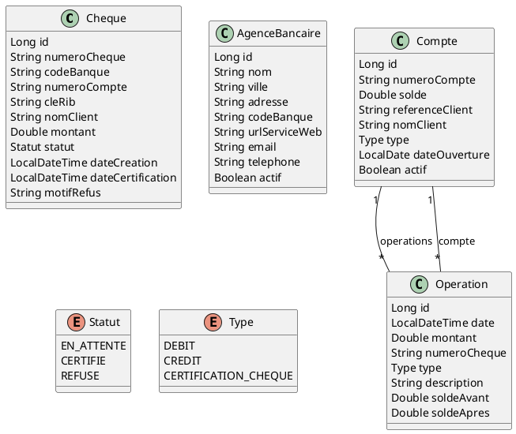

## Domain Class Diagram (PlantUML)


## Domain Class Diagram

Below is a textual class diagram for the main business entities:

```
Cheque
  - id: Long
  - numeroCheque: String (unique)
  - codeBanque: String (3 chars)
  - numeroCompte: String
  - cleRib: String (2 chars)
  - nomClient: String
  - montant: Double
  - statut: Enum (EN_ATTENTE, CERTIFIE, REFUSE)
  - dateCreation: LocalDateTime
  - dateCertification: LocalDateTime (nullable)
  - motifRefus: String (nullable, max 255)

AgenceBancaire
  - id: Long
  - nom: String
  - ville: String
  - adresse: String
  - codeBanque: String (unique, 3 chars)
  - urlServiceWeb: String
  - email: String
  - telephone: String
  - actif: Boolean

Compte
  - id: Long
  - numeroCompte: String (unique)
  - solde: Double
  - referenceClient: String
  - nomClient: String
  - type: Enum (COURANT, EPARGNE)
  - dateOuverture: LocalDate
  - actif: Boolean
  - operations: List<Operation>

Operation
  - id: Long
  - date: LocalDateTime
  - montant: Double
  - numeroCheque: String (nullable)
  - type: Enum (DEBIT, CREDIT, CERTIFICATION_CHEQUE)
  - description: String (max 500)
  - soldeAvant: Double
  - soldeApres: Double
  - compte: Compte
```

Relations:
- Compte 1..* --- Operation
- Operation *..1 --- Compte
# Copilot Instructions for ChequeSecure

## Project Overview
ChequeSecure is a distributed platform for electronic cheque certification in Morocco, built on a microservices architecture using Spring Cloud. The system is designed for scalability, security, and resilience, with each service responsible for a distinct business domain.

## Architecture & Major Components
- **Microservices:**
  - `commercant-service`: Manages cheque entry, status tracking, and certification requests.
  - `banque-centrale-service`: Orchestrates certification, manages bank agencies, routes requests via OpenFeign.
  - `agence-bancaire-service`: Handles account management, cheque certification, and operation history.
  - `gateway-service`: API gateway with JWT validation and routing.
  - `discovery-service`: Eureka service discovery.
  - `config-service`: Centralized configuration management.
- **Security:** OAuth2/OIDC via Keycloak, role-based access (ADMIN, BANQUE_CENTRALE, AGENCE, COMMERCANT).
- **Resilience:** Inter-service calls use OpenFeign with Resilience4J (Circuit Breaker, Retry, TimeLimiter).
- **Data:** Each service uses H2 or PostgreSQL for persistence.
- **Documentation:** REST APIs documented with OpenAPI/Swagger (springdoc-openapi).

## Developer Workflows
- **Build:** `./mvnw clean install` (multi-module Maven project)
- **Run:** `./mvnw spring-boot:run` (per service)
- **Test:** `./mvnw test`
- **Swagger UI:** Enabled via springdoc-openapi for API exploration
- **Containerization:** Docker Compose for full stack deployment (see project root for compose file)
- **Key files:**
  - `pom.xml`: Declares Spring Boot, Spring Cloud, OpenFeign, Resilience4J, OAuth2, Swagger dependencies
  - `src/main/resources/application.properties`: Service-specific config
  - `src/main/java/com/example/demo/`: Main application logic (single-service example; multi-service expected)

## Patterns & Conventions
- **Spring Boot & Spring Cloud:** Standard annotations, dependency injection, and configuration
- **OpenFeign:** Used for synchronous REST calls between services
- **Resilience4J:** Circuit breaker, retry, and timeout patterns for fault tolerance
- **Entity Modeling:**
  - Cheque, AgenceBancaire, Compte, Operation (see brief for fields and constraints)
- **Role Management:** Keycloak roles enforced at gateway and service level
- **No agency deletion if certifications are pending**
- **Operation history is immutable and timestamped**

## Integration Points
- **Maven:** All dependencies managed in `pom.xml` (Spring Boot, Spring Cloud, Feign, Resilience4J, Swagger, OAuth2, H2, MySQL/Postgres, Lombok)
- **Keycloak:** For authentication/authorization
- **Eureka:** Service discovery
- **Docker Compose:** For orchestration and deployment

## Examples
- Cheque entity: `numeroCheque`, `codeBanque`, `statut`, `dateCertification`, etc.
- Agency entity: `codeBanque`, `urlServiceWeb`, etc.
- Account entity: `numeroCompte`, `solde`, `type`, `operations`
- Operation entity: `type`, `montant`, `date`, `soldeAvant`, `soldeApres`

## Agent Guidance
- Follow microservices separation and domain boundaries
- Use OpenFeign for inter-service communication
- Apply Resilience4J for fault tolerance
- Secure endpoints with OAuth2/Keycloak
- Reference entity fields and business rules from the brief
- Use Maven and Docker Compose for builds and deployment
- Document APIs with OpenAPI/Swagger

---

If any section is unclear or missing, please provide feedback for further refinement.